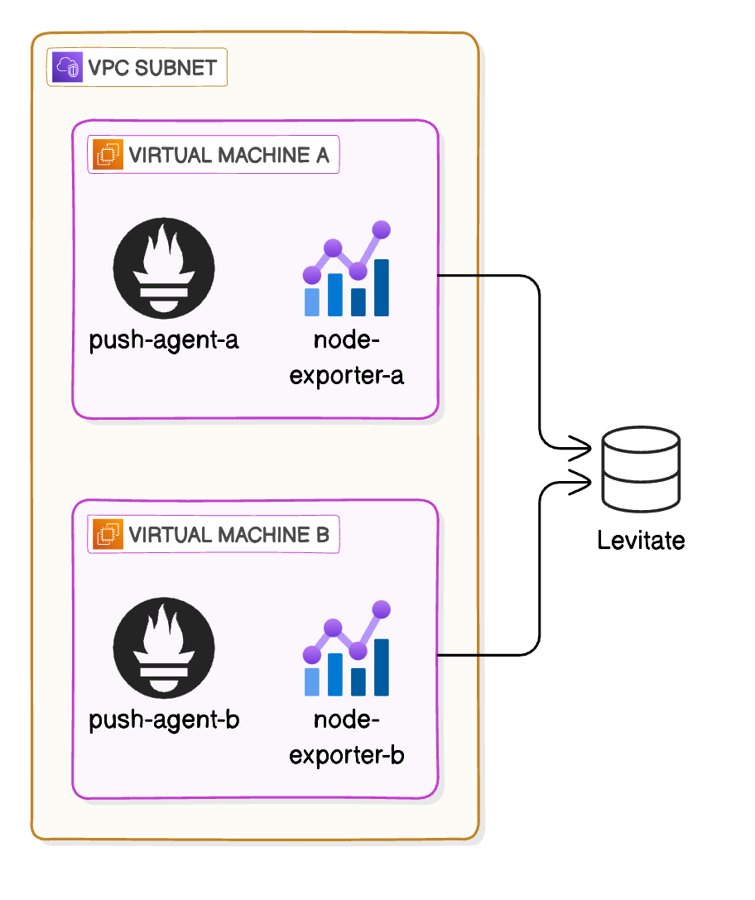

# Node Exporter To Levitate



## Prerequisites

- **Linux-based OS** - The scripts are designed for use on Linux Ubuntu systems.
- **Bash Shell** - The shell scripts should be run in a Bash environment.
- **Docker** - Docker needs to be installable on your system. The included script will attempt to install it if not present.
- **Node Exporter** - The scripts will install Node Exporter if it's not already installed.

## Scripts and Files

- `docker_installer.sh`: This script automates the installation of Docker and Docker Compose.
- `node_exporter_installer.sh`: This script handles the installation of Prometheus' Node Exporter.
- `run_containers.sh`: After verifying installations and environment variables, this script will set up and run Docker Compose configurations.
- `docker-compose.yaml`: Configuration file for Docker Compose to set up the vmagent service.
- `vmagent.yaml`: Configuration file for vmagent that defines scrape configurations for Prometheus metrics.

## Setup Instructions

### 1. Clone the Repository

Clone this repository to your local machine using the following command:
```bash
git clone https://github.com/last9/node-exporter-to-levitate.git
```

### 2. Set Environment Variables

Before running the `run_containers.sh` script, ensure you set the necessary environment variables:
```bash
export LEVITATE_USERNAME='levitate_cluster_username'
export LEVITATE_PASSWORD='levitate_cluster_password'
export LEVITATE_CLUSTER_URL='levitate_cluster_write_url'
```

### 3. Make Scripts Executable

Ensure that all the scripts are executable:
```bash
chmod +x docker_installer.sh node_exporter_installer.sh run_containers.sh
```

### 4. Run Installation Scripts

Run Node Exporter installation script:
```bash
sudo ./node_exporter_installer.sh
```

### 5. Deploy Docker Compose

Execute the `run_containers.sh` script to start your services using Docker Compose:
```bash
./run_containers.sh
```

## Troubleshooting

- **Permission Issues**: Make sure the scripts are executable and you have the necessary permissions to install software on your machine.
- **Environment Variables**: If Docker Compose does not start properly, check that all required environment variables are set.
- **Docker and Node Exporter Installations**: Ensure Docker and Node Exporter are properly installed and can be called from the command line.

## Additional Notes

- Always check the logs if anything fails to start or behaves unexpectedly.
- Remember to check for any updates in the dependencies used in this project.
